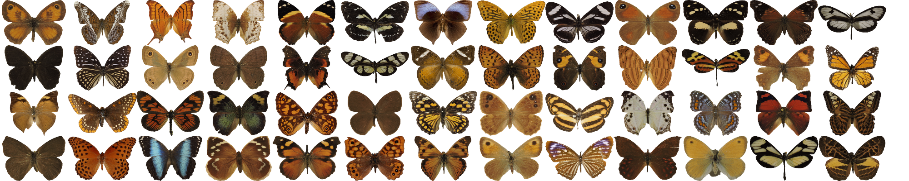
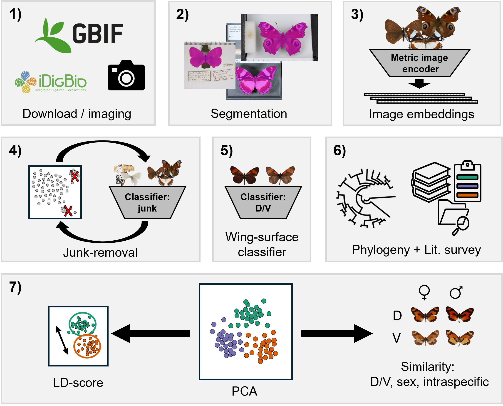

# nymphalid-phenomics

</div><br>
<div align="center">
	<p></p>
</div>

## About
This repository contains the analytical pipeline and code to reproduce the results of the paper "Aposematic color patterns are the dominant axis of phenotypic diversification in Nymphalid butterflies" (Lürig et al. 2025). The pipeline combines image acquisition (mostly from online sources), segmentation, feature extraction, and phylogenetically informed statistical analysis to quantify aposematic color patterns in over one third of all species of the butterfly family Nymphalidae. 

## Quickstart
Reproduction of figures and results only - for image analysis pipeline see Analysis section.
1. **Download the repo:**
	- Download the repository from [Zenodo](https://doi.org/10.5281/zenodo.17204330), unpack, and `cd` into the folder.
2. **Run the analysis scripts:**
	- Run scripts [`03_make_data.R`](scripts/03_make_data.R) and [`04_analysis.R`](scripts/04_analysis.R).

## Image analysis 
### Overview

For the paper, we executed the full pipeline, which included: 1) image acquisition from GBIF, iDigBio, and our own imaging (also see [data_raw/README.md](data_raw/README.md)); 2) segmentation (see script 01); 3) image encoding (see script 02); 4) data cleaning; 5) wing surface classification; 6) literature review; and 7) statistical analysis (see scripts 03 and 04). The code for data cleaning and classifier training is not provided here, as these steps involved iterative and manual steps (e.g., using interactive plots), but a detailed description of the complete procedure can be found in the methods section of the manuscript. 

</div><br>
<div align="center">
    <p></p>
</div>


### Installation 

1. **Create the Python environment:**
	```bash
	mamba env create -f environment.yml -n nymphalidae1
	conda activate nymphalidae1
	```
2. **Install packages:**

    (in this order)

	UNICOM (image encoder):
    ```bash
    pip install --no-cache-dir "unicom @ git+https://github.com/deepglint/unicom.git@4d84a3b496a47bcad68467d71c5ca787b0366042"
    ```

	PyTorch (choose wheel matching your CUDA - may need the `--force-reinstall` flag):
    ```bash
    pip install --index-url https://download.pytorch.org/whl/cu126 torch torchvision
    ```

### Download data

A sample of raw images to demonstrate the segmentation step, as well as all segmentation masks for the feature extraction step, an all primary tabular- and meta-data are available via Zenodo: [https://doi.org/10.5281/zenodo.17204330](https://doi.org/10.5281/zenodo.17204330). 

**Structure:**
- `data_raw/`
    - `images_sample/` — Sample of raw images (from GBIF)
    - `segmentation_masks_clean/` — Segmented masks (produced by pipeline)
    - `segmentation_masks_moths/` — Segmented masks (moth dataset)
    - `tables/` — Embeddings and features (produced by pipeline)
- `data/`
    - `data_primary/` — Primary tabular and meta-data (labels, feature-key, etc.)
    - `data_secondary/` — Derived from primary with make_data script (LD-scores, similarity, etc.)
    - `analyses_secondary/` — Regressions, phylogenetic modelling, etc.
- `scripts/` - scripts to reproduce all results.
- `figures/` - figures from the manuscript.
- `tables/` - tables from the manuscript.

### Analysis

Download the archive, unpack, and run the scripts step by step: 

**In Python:**
- [`01_segmentation_demo.ipynb`](scripts/01_segmentation_demo.ipynb) — segments butterflies from images using GroundedSAM (demo, without cleaning-steps).
- [`02_feature_extraction.ipynb`](scripts/02_feature_extraction.ipynb) — extracts embeddings using UNICOM.

**In R:**
- [`03_make_data.R`](scripts/03_make_data.R) — assembles specimen-level and species-level tables for analysis.
- [`04_analysis.R`](scripts/04_analysis.R) — runs all statistical models and generates figures and tables for the paper.
